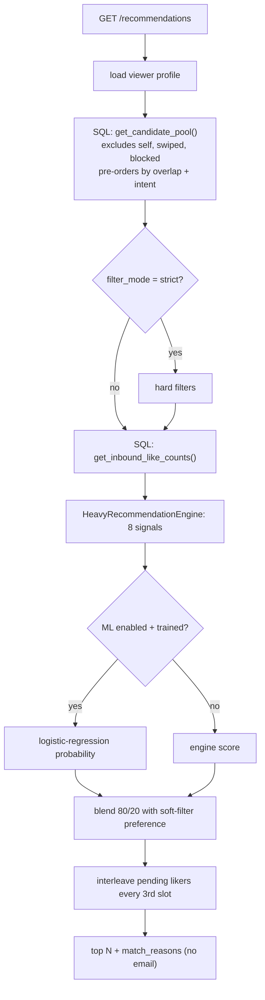

# Matching, ranking and ML — how it works

How `GET /api/v1/recommendations` produces a ranked, explained list of
collaborators.

Core files:
- `app/api/v1/recommendations.py`: endpoint and query parameters
- `app/services/recommendation_service.py`: pipeline
- `app/services/collab.py`: intent vocabulary, compatibility, complementarity, match reasons
- `app/services/heavy_recommendation_engine.py`: eight-signal scorer
- `app/services/ml_features.py`, `ml_ranker.py`, `ml_trainer.py`: learned re-ranker
- `supabase/migrations/20260929000200_security_and_matching.sql`: `get_candidate_pool`, `get_pending_liker_ids`, `get_inbound_like_counts`

---

## 1. Pipeline

### Candidate generation (SQL)
`get_candidate_pool(viewer, limit)` runs inside Postgres, so the exclusion list
never travels over HTTP. The old approach put every swiped ID in the URL, which
broke after a few hundred swipes and was capped at 1,000 rows. It returns up to
`CANDIDATE_POOL_SIZE` (default 200, doubled when filters are active) users who:
- are not the viewer, not already swiped, not blocked in either direction
- have a real profile (`public_repos > 0` or at least one language)

The pool is pre-ordered by: people who already liked the viewer first, then
shared languages + shared topics + 2× wanted-skill matches + 2× compatible
intents (including mentor ↔ mentee), then recency.

## 2. Scoring signals (`HeavyRecommendationEngine`)

| Signal | Weight | Definition |
|---|---|---|
| `intent_fit` | 0.20 | `collab.intent_compatibility`: 1 if intents are compatible (same symmetric intent, or mentor ↔ mentee), 0 if not, 0.5 if either side hasn't said |
| `skill_complement` | 0.20 | Share of what each side is *seeking* that the other *has*, averaged over the directions that are defined |
| `tech_match` | 0.20 | Jaccard overlap of languages (case-insensitive) |
| `interest_match` | 0.15 | TF-IDF cosine over interests + GitHub topics. Each label is one token, so "Web Dev" and "Mobile Dev" don't match on "dev" |
| `activity_level` | 0.10 | 1 − relative gap of `log1p(2·followers + 5·repos + stars)`, which keeps juniors with peers |
| `community_popularity` | 0.05 | Distinct inbound likes ÷ pool maximum |
| `recency_boost` | 0.05 | 1.0 (≤1 day), 0.8 (≤3), 0.5 (≤7), 0.2 (≤30), else 0 |
| `location_bonus` | 0.05 | 1.0 same location, 0.5 substring overlap |

`score = 100 × Σ(signal × weight) × quality`, capped at 100, where `quality`
adds +4% for a bio, +3% for an avatar and +5% for a pitch.

**Why these weights:** the original engine was similarity-only. Collaboration
depends on compatible goals and complementary skills, so those two signals
together carry 40%. The weights are a starting point; the ML re-ranker learns
from real swipes.

## 3. Match reasons (`collab.match_reasons`)

Short sentences written from the viewer's point of view, most important first
(the API returns up to 3):

1. Intent: "You're both looking for a co-founder" / "Mentors developers — you're looking for a mentor"
2. Skills you want: "Knows TypeScript — a skill you want"
3. Skills they want: "Looking for Rust, which you know"
4. Shared languages: "You both write Rust and Go"
5. Shared interests or topics: "Both into AI / ML"
6. Location: "Also in Berlin"
7. Proof of work: "1.2k stars earned on GitHub"
8. Activity: "Active today" / "Active this week"

## 4. Soft vs strict filters

Filters: `languages`, `interests`, `looking_for`, `location`, `min_followers`,
`min_public_repos`, `active_within_days`.

- **soft** (default): each active filter gives a 0..1 score. The mean is the
  preference score, blended at 20% into the final rank.
- **strict**: candidates must pass every active filter before ranking.

## 5. People who already liked you

Pending likers (they liked the viewer, and the viewer hasn't swiped yet) are
placed at positions 0, 3, 6, … and never flagged in the response. This keeps
mutual matches flowing without making "who liked me" inferable from the card
order. That list is reserved for a future Pro feature. The old implementation
put all of them first, which leaked it.

## 6. Learned re-ranker

**Features** (`ml_features.extract_pair_features`): language/topic Jaccard and
intersections, `intent_compat`, `skill_complement`, follower/repo similarity,
avatar/bio/pitch flags, recency buckets, normalised popularity, bias. New
features are backwards compatible: missing weights count as 0.

**Training** (`POST /api/v1/admin/retrain-ml`, `X-Admin-Secret`):
- up to 20,000 recent swipes, paginated past PostgREST's 1,000-row cap
- label = like/superLike (superLike weighted 3×), dislike = 0
- **chronological split**: train on the oldest 80%, validate on the newest 20%
  (the original code had this reversed, which leaked future data into training)
- L2 logistic regression; weights stored in `ml_model_params`

**Inference**: when `ML_RANKING_ENABLED=true` and a model exists, rank by the
like probability (blended with soft preferences). Weights are cached for
5 minutes; the old code did one database query per candidate.

## 7. Where it goes next
- Replace TF-IDF with embeddings of READMEs and repo descriptions (pgvector) for real semantic similarity.
- Add outcome labels (day-7 "building together?") so the model optimises for collaborations, not likes.
- Precompute candidate features when the user base outgrows the full-scan pool query.
